# Brandy Backend System Architecture Documentation

## Executive Summary

The **Brandy Backend** is architected as a **Modular Monolith with an Event-Driven Asynchronous Processing Infrastructure**. It combines domain-driven backend modules with a robust queue management system built on top of **BullMQ** and **Redis**, alongside **node-cron** and **BullMQ repeatable jobs** for scheduled tasks.

---

## 1. High-Level Architecture Overview

```mermaid
graph TD
    %% Client Tier
    subgraph Client Tier
        Frontend[React Frontend / Web Apps]
        ExternalClients[External API Consumers]
    end

    %% API Gateway & Routing Tier
    subgraph Express Application Layer (src/app.js)
        SecurityMiddleware[Helmet / CORS / RateLimit / XSS / MongoSanitize]
        ExpressRouter[Express Module Routers]
    end

    %% Modular Domain Tier
    subgraph Modular Domain Services (src/modules/*)
        AuthMod[Auth Module]
        CollabMod[Collaboration Module]
        ModMod[Moderation Module]
        AIMemMod[AI Memory Module]
        OtherMods[User / Brand / Campaign / Payment / Support ...]
    end

    %% Event Infrastructure
    subgraph Event System (src/events/*)
        EventBus[Event Bus (Node EventEmitter)]
        EventListeners[Event Listeners (events/index.js)]
    end

    %% Background Queue Tier
    subgraph Queue & Worker Infrastructure (src/queues/*)
        QueueMgr[Queue Manager (queues/queueManager.js)]
        BaseWorker[Worker Factory (queues/baseWorker.js)]
        
        NotificationQueue[(notification_queue)]
        EmailQueue[(email_queue)]
        AnalyticsQueue[(analytics_queue)]
        ModerationQueue[(moderation_queue)]
        AIQueue[(ai_queue)]
    end

    %% Cron / Scheduling Tier
    subgraph Scheduling Layer
        NodeCron[node-cron (src/modules/admin/admin.cron.js)]
        BullRepeat[BullMQ Repeatable Jobs (analytics_queue)]
    end

    %% Data Tier
    subgraph Data Infrastructure
        RedisDb[(Redis Instance)]
        MongoDb[(MongoDB Database)]
    end

    %% Connections & Flow
    Frontend -->|HTTP / REST / WebSockets| SecurityMiddleware
    ExternalClients -->|HTTP / Webhooks| SecurityMiddleware
    SecurityMiddleware --> ExpressRouter
    ExpressRouter --> AuthMod & CollabMod & ModMod & AIMemMod & OtherMods

    AuthMod & CollabMod & ModMod & AIMemMod & OtherMods -->|DB Operations| MongoDb
    AuthMod & CollabMod & ModMod & AIMemMod & OtherMods -->|Emit Internal Events| EventBus

    EventBus --> EventListeners
    EventListeners -->|addJob()| QueueMgr

    NodeCron -->|Schedule Daily Scan| QueueMgr
    BullRepeat -->|Schedule Nightly Prune| QueueMgr

    QueueMgr -->|Push / Store Jobs| RedisDb
    RedisDb -->|Poll / Process Jobs| BaseWorker

    BaseWorker -->|Process Notifications| NotificationQueue
    BaseWorker -->|Process Emails| EmailQueue
    BaseWorker -->|Process Analytics & AI Prune| AnalyticsQueue
    BaseWorker -->|Process Content & Fraud Scan| ModerationQueue
    BaseWorker -->|Process AI Tasks| AIQueue
```

---

## 2. Services Architecture (Modular Monolith)

The application avoids microservice operational overhead while keeping code cleanly separated by adopting a **Modular Monolith** structure.

### 2.1 File & Layer Standard per Module

Every domain module resides inside `src/modules/<module_name>` and adheres to the strict separation of concerns:

```
src/modules/<module_name>/
├── <module_name>.routes.js      # Endpoint definitions & Middleware attachments
├── <module_name>.controller.js  # Request Parsing, Input Validation, Response Formatting
├── <module_name>.service.js     # Core Business Logic, Data Mutation, Event Emitting
├── <module_name>.model.js       # Mongoose Schemas, Indexes, Model Hooks
└── <module_name>.validation.js  # Request Body / Parameter Sanitization Schemas
```

### 2.2 Core Modules Summary

| Module | Core Responsibility | Key Services / Files |
| :--- | :--- | :--- |
| **Auth** | Authentication, JWT, OAuth state, Password resets | [`auth.service.js`](file:///Users/samiafzal/Desktop/FYP/03_Source_Code/FYP/brandy-backend/server/src/modules/auth/auth.service.js), [`auth.controller.js`](file:///Users/samiafzal/Desktop/FYP/03_Source_Code/FYP/brandy-backend/server/src/modules/auth/auth.controller.js) |
| **Collaboration** | Brand-Influencer campaign workflows, deliverables, payouts | [`collaboration.service.js`](file:///Users/samiafzal/Desktop/FYP/03_Source_Code/FYP/brandy-backend/server/src/modules/collaboration/collaboration.service.js), [`request.service.js`](file:///Users/samiafzal/Desktop/FYP/03_Source_Code/FYP/brandy-backend/server/src/modules/collaboration/request.service.js), [`deliverable.service.js`](file:///Users/samiafzal/Desktop/FYP/03_Source_Code/FYP/brandy-backend/server/src/modules/collaboration/deliverable.service.js), [`action.service.js`](file:///Users/samiafzal/Desktop/FYP/03_Source_Code/FYP/brandy-backend/server/src/modules/collaboration/action.service.js) |
| **Moderation** | Abuse keyword scanning, user reports, automated fraud detection | [`moderation.service.js`](file:///Users/samiafzal/Desktop/FYP/03_Source_Code/FYP/brandy-backend/server/src/modules/moderation/moderation.service.js), [`moderation.queue.js`](file:///Users/samiafzal/Desktop/FYP/03_Source_Code/FYP/brandy-backend/server/src/queues/moderation.queue.js) |
| **AI Memory** | User behavior summarization, interaction tracking, context pruning | [`memory.service.js`](file:///Users/samiafzal/Desktop/FYP/03_Source_Code/FYP/brandy-backend/server/src/modules/aiMemory/memory.service.js) |
| **Support** | Support ticket lifecycle, issue tracking | [`support.service.js`](file:///Users/samiafzal/Desktop/FYP/03_Source_Code/FYP/brandy-backend/server/src/modules/support/support.service.js) |
| **Brand / Influencer**| Profiles, portfolios, analytics, matching metrics | [`brand.service.js`](file:///Users/samiafzal/Desktop/FYP/03_Source_Code/FYP/brandy-backend/server/src/modules/brand/brand.service.js) |

### 2.3 Shared Infrastructure Services

Located in `src/services/`:
- **`cache.service.js`**: Low-level Redis Caching abstraction for high-read endpoints.
- **`cacheInvalidation.service.js`**: Entity-based cache tag clearing to prevent stale data reading.

---

## 3. BullMQ Architecture & Queue Subsystem

BullMQ manages asynchronous background processing, preventing heavy tasks (e.g., sending emails, AI summarization, database pruning, moderation scans) from blocking the HTTP request loop.

### 3.1 Queue Manager (`src/queues/queueManager.js`)

Centralizes queue creation and lifecycle:

- **Shared Redis Connection**: Connects using [`getSharedConnection()`](file:///Users/samiafzal/Desktop/FYP/03_Source_Code/FYP/brandy-backend/server/src/config/redis.js) from `src/config/redis.js`.
- **Default Job Settings**:
  - `attempts: 3`: Retries failed jobs up to 3 times.
  - `backoff`: Exponential retry strategy starting at `1000ms` ($1s \rightarrow 2s \rightarrow 4s$).
  - `removeOnComplete: true`: Automatically deletes completed jobs to save Redis RAM.
  - `removeOnFail: false`: Retains failed jobs for monitoring and debugging.

```javascript
export const getQueue = (queueName) => {
    if (!queues[queueName]) {
        queues[queueName] = new Queue(queueName, {
            connection: getSharedConnection(),
            defaultJobOptions: {
                attempts: 3,
                backoff: { type: 'exponential', delay: 1000 },
                removeOnComplete: true,
                removeOnFail: false,
            }
        });
    }
    return queues[queueName];
};
```

### 3.2 Worker Subsystem (`src/queues/baseWorker.js` & `src/queues/index.js`)

#### Base Worker Factory (`src/queues/baseWorker.js`)
Standardized worker creation wrapper with concurrency control and error handling:
- **Concurrency**: Set to `5` parallel jobs per worker instance.
- **Job Retention**: Keeps max 100 completed jobs and max 1000 failed jobs.
- **Error Propagation**: Re-throws uncaught errors inside processors so BullMQ can handle retries.

#### Active Queues & Workers Breakdown (`src/events/constants.js` & `src/queues/index.js`)

```
+---------------------+-------------------------------+--------------------------------------------+
| Queue Name          | Redis Key                     | Primary Job Responsibilities               |
+---------------------+-------------------------------+--------------------------------------------+
| QUEUES.NOTIFICATIONS| "notification_queue"          | In-app Push Notifications                  |
| QUEUES.EMAILS       | "email_queue"                 | Welcome Emails, Security Login Alerts      |
| QUEUES.ANALYTICS    | "analytics_queue"             | Activity Audit Logging, AI Memory Pruning  |
| QUEUES.MODERATION   | "moderation_queue"            | Automated Fraud Checks, Content Scanning   |
| QUEUES.AI           | "ai_queue"                    | Asynchronous AI Embeddings / Matching Jobs |
+---------------------+-------------------------------+--------------------------------------------+
```

---

## 4. Event-Driven System Architecture

To achieve zero coupling between domain services and background workers, the backend uses a centralized Event Bus (`src/events/eventBus.js`) based on Node.js `EventEmitter`.

### 4.1 Event Flow Pattern

```
[ Domain Controller / Service ] 
         │
         ▼ emit(EVENT_NAME, payload)
[ Event Bus (src/events/eventBus.js) ]
         │
         ▼ listen in registerListeners()
[ Event Handler (src/events/index.js) ]
         │
         ▼ addJob(QUEUE_NAME, jobName, payload)
[ BullMQ Queue Manager ]
         │
         ▼ Pushes to Redis
[ Redis Queue Storage ]
         │
         ▼ Consumed by Worker
[ Background Worker (src/queues/index.js) ]
```

### 4.2 Registered Event Mappings (`src/events/index.js`)

- `user:registered` $\rightarrow$ Enqueues `welcome_email` in `email_queue` & logs `system:audit_log`.
- `user:logged_in` $\rightarrow$ Enqueues `login_activity` in `analytics_queue` & sends `login_alert` via `email_queue`.
- `collab:status_changed` $\rightarrow$ Enqueues `status_update` notification in `notification_queue`.
- `user:blocked` $\rightarrow$ Directly calls `memoryService.recordEvent()` and `summarizeContext()`.
- `collab:payout_triggered` $\rightarrow$ Records financial activity in AI memory.
- `system:security_alert` $\rightarrow$ Enqueues security payload into `analytics_queue`.

---

## 5. Crons & Scheduled Jobs Architecture

The backend supports two distinct scheduling techniques depending on task complexity and persistence requirements.

### 5.1 System Cron Map

```mermaid
gantt
    title Scheduled Jobs Execution Timeline
    dateFormat  HH:mm
    axisFormat %H:%M

    section node-cron
    Daily Moderation Scan (0 0 * * *) :00:00, 15m

    section BullMQ Repeatable
    AI Memory Prune (0 0 * * *)       :00:00, 10m
```



### 5.2 Cron Types & Implementations

#### 1. In-Process Node Cron (`src/modules/admin/admin.cron.js`)
Uses `node-cron` to schedule lightweight in-memory triggers.
- **Job**: `Daily Moderation Scan`
- **Schedule**: `0 0 * * *` (Daily at 00:00 UTC/Server local time)
- **Execution Flow**:
  1. Triggered at midnight.
  2. Scans messages from the past 24 hours for abuse keywords (e.g. harass, extortion, off-platform payment terms).
  3. Flags high-risk messages ($\ge 3$ matched keywords) for administrative review.

#### 2. BullMQ Repeatable Queue Jobs (`src/queues/index.js`)
Uses BullMQ's native Redis-backed scheduler.
- **Job**: `prune_ai_memory` (in `analytics_queue`)
- **Schedule**: `{ repeat: { pattern: '0 0 * * *' } }`
- **Execution Flow**:
  1. BullMQ maintains a repeatable job timer inside Redis.
  2. When triggered at midnight, the job is pushed to `analytics_queue`.
  3. `AnalyticsWorker` calls `memoryService.runPruningJob()` to archive or compress old AI memory logs.

---

## 6. Redis Configuration & Connection Lifecycle

Redis serves as the backend engine for BullMQ queues, rate limiting, and caching (`src/config/redis.js`).

### 6.1 Redis Requirements for BullMQ
- `maxRetriesPerRequest: null`: **Mandatory requirement** by BullMQ so blocking commands (like `BRPOPLPUSH` / `XREADGROUP`) do not fail during transient network drops.
- **Connection Duplication**: BullMQ Workers duplicate Redis connections using `connection.duplicate()` because worker threads require dedicated blocking socket connections.

### 6.2 Redis Health Check Endpoint
The API exposes `/api/v1/health` in [`src/app.js`](file:///Users/samiafzal/Desktop/FYP/03_Source_Code/FYP/brandy-backend/server/src/app.js#L289-L303):

```json
{
  "status": "ok",
  "mongo": "connected",
  "redis": "ready",
  "queues": {
    "expected": ["notification_queue", "moderation_queue", "analytics_queue", "ai_queue", "email_queue"],
    "initialized": ["notification_queue", "moderation_queue", "analytics_queue", "ai_queue", "email_queue"]
  },
  "timestamp": "2026-08-19T22:12:00.000Z"
}
```

---

## 7. Application Bootstrapping & Graceful Shutdown

The application startup and shutdown lifecycle is managed in [`src/index.js`](file:///Users/samiafzal/Desktop/FYP/03_Source_Code/FYP/brandy-backend/server/src/index.js).

### 7.1 Startup Order
1. Load & Validate Environment Variables (`validateEnv()`)
2. Connect to MongoDB (`connectDB()`)
3. Initialize Queues (`initQueues()`)
4. Start Workers (`startWorkers()`)
5. Register Event Listeners (`registerListeners()`)
6. Start Cron Schedulers (`initAdminCronJobs()`)
7. Start Express HTTP & Socket.io Server

### 7.2 Graceful Shutdown Order (`SIGINT` / `SIGTERM`)
1. Stop accepting new queue jobs and close active workers (`closeWorkers()`).
2. Close all active queues (`closeQueues()`).
3. Stop HTTP server (`httpServer.close()`).
4. Close Redis connections (`closeRedis()`).
5. Close MongoDB connection (`mongoose.connection.close()`).
6. Exit process gracefully with code `0`.
