# Final Year Project Documentation
# **Project Title: Brandly - AI-Based Brand Influencer Platform**

**Date:** May 2026
**Course:** Bachelor of Computer Science
**Subject:** Final Year Project (FYP)

---

# Table of Contents

1. [CHAPTER 1: Gathering & Analyzing Information](#chapter-1-gathering--analyzing-information)
   - 1.1 Introduction
   - 1.2 Problem Statement
   - 1.3 Aim & Objectives
   - 1.4 Scope
   - 1.5 Methodology
   - 1.6 Definitions, Acronyms and Abbreviations
   - 1.7 Project Timeline (Gantt Chart)
2. [CHAPTER 2: Software Requirement Specification](#chapter-2-software-requirement-specification)
   - 2.1 Literature Review
   - 2.2 Stakeholders List
   - 2.3 Domain Requirements
   - 2.4 Functional Requirements
   - 2.5 Non-Functional Requirements
   - 2.6 Feasibility Study
   - 2.7 Risk Management
   - 2.8 Domain Knowledge
3. [CHAPTER 3: Analysis](#chapter-3-analysis)
   - 3.1 Introduction
   - 3.2 System Requirements
   - 3.3 Use Case Specifications
   - 3.4 Use Case Diagrams
   - 3.5 Data Flow Diagram (Level 0 and 1)
4. [CHAPTER 4: Design](#chapter-4-design)
   - 4.1 Introduction
   - 4.2 Software Architecture Diagram
   - 4.3 Class Diagram
   - 4.4 Database Diagram (ERD)
   - 4.5 Sequence Diagram
   - 4.6 Activity Diagram
   - 4.7 Component & Deployment Diagrams
   - 4.8 Data Dictionary
   - 4.9 System Security Architecture
5. [CHAPTER 5: Graphical User Interfaces](#chapter-5-graphical-user-interfaces)
   - 5.1 Interface Structure
   - 5.2 Navigation & Workflow
   - 5.3 Form Design & Validation
   - 5.4 Role-Based Interfaces
6. [CHAPTER 6: Testing](#chapter-6-testing)
   - 6.1 Introduction
   - 6.2 Testing Strategy
   - 6.3 Types of Testing Performed
   - 6.4 Test Plan
   - 6.5 Test Cases (TC-01 to TC-50)
   - 6.6 Test Results & Analysis
7. [CHAPTER 7: Conclusion and Future Work](#chapter-7-conclusion-and-future-work)
   - 7.1 Summary of Findings
   - 7.2 Challenges & Limitations
   - 7.3 Future Work
   - 7.4 Conclusion

---

# CHAPTER 1: Gathering & Analyzing Information

## 1.1 Introduction
In the contemporary digital era, the landscape of marketing has undergone a paradigm shift. Traditional advertising mediums are increasingly being overshadowed by **Influencer Marketing**, a multi-billion dollar industry where brands collaborate with social media creators to reach targeted audiences. However, as the industry scales, so do its complexities.

**Brandly** is an AI-powered platform designed to professionalize and secure these interactions. It serves as a unified workspace where brands can discover influencers, manage high-volume campaigns, and execute collaborations with real-time synchronization and secure escrow payment protections.

## 1.2 Problem Statement
Despite the growth of influencer marketing, the sector faces several critical "friction points" that hinder productivity and trust:
1.  **Lack of Real-Time Sync**: Both brands and influencers often suffer from communication gaps. Deliverable statuses are frequently tracked in spreadsheets or fragmented chat apps, leading to manual refresh cycles and outdated project states.
2.  **Payment Insecurity**: Influencers fear non-payment after work completion, while brands fear poor-quality work or ghosting after upfront payments.
3.  **Inconsistent Workflows**: There is no standard "contractual" process. Projects often start without clear agreement on terms, leading to disputes over revisions and deadlines.
4.  **Information Overload**: Scaling a brand from 5 to 50 influencers is impossible without an automated system to manage discovery, tracking, and payouts.

## 1.3 Aim & Objectives
The primary aim of **Brandly** is to provide a secure, real-time, and AI-driven ecosystem for professional influencer marketing.

### Primary Objectives:
1.  **Develop a Secure Escrow System**: Implement a Stripe-based financial gateway that holds funds until deliverables are approved, ensuring safety for both parties.
2.  **Implement Real-Time Synchronization**: Utilize WebSockets (Socket.io) to ensure that task status changes and agreement signatures are reflected instantly across all dashboards.
3.  **Enforce Mutual Agreements**: Create a digital contract workflow where project actions are gated by mutual signatures.
4.  **Optimize Professional Workflows**: Provide a Kanban-style deliverable management system that categorizes work into "In Progress," "Review," and "Approved" states.

## 1.4 Scope
The project encompasses the following domains:
- **Web Application**: A full-stack responsive web platform.
- **Role-Based Access**: Specialized dashboards for Brands, Influencers, and Administrators.
- **Campaign Management**: Tools for brands to create briefs and for influencers to discover opportunities.
- **Collaboration Workspace**: A shared project area for managing tasks, signatures, and payments.
- **Exclusions**: The current version does not include a native mobile app (iOS/Android) but is optimized for mobile browsers.

## 1.5 Methodology
The project follows the **Agile Development Methodology**. This approach was chosen to allow for iterative improvements, particularly in the complex areas of payment integration and real-time socket management.
- **Sprint 1**: Backend architecture and User Identity (Auth).
- **Sprint 2**: Campaign creation and discovery logic.
- **Sprint 3**: Collaboration lifecycle and Agreement workflow.
- **Sprint 4**: Stripe Escrow and Socket.io synchronization.
- **Sprint 5**: Testing, Cleanup, and Documentation.

## 1.6 Definitions, Acronyms and Abbreviations
- **FYP**: Final Year Project
- **API**: Application Programming Interface
- **JWT**: JSON Web Token (Used for authentication)
- **ERD**: Entity Relationship Diagram
- **Escrow**: A financial arrangement where a third party (Brandly) holds funds until conditions are met.
- **Deliverable**: A specific piece of content (Post, Story, Video) promised by an influencer.
- **Socket.io**: A library that enables real-time, bi-directional communication between web clients and servers.

## 1.7 Project Timeline (Gantt Chart)
The following chart illustrates the development lifecycle of Brandly over a 16-week academic period.

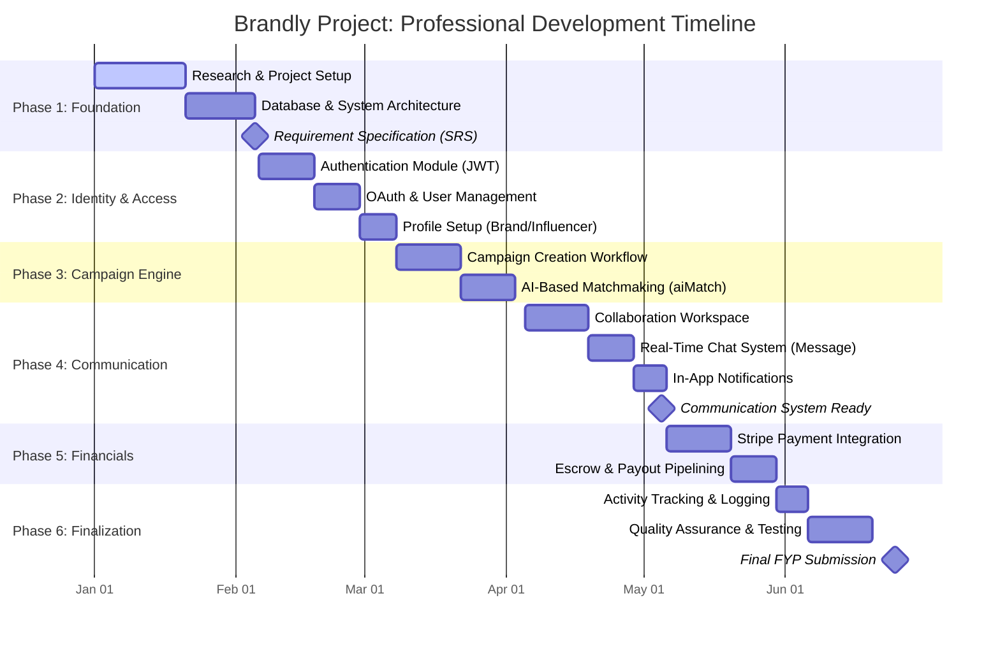

---

# CHAPTER 2: Software Requirement Specification

## 2.1 Literature Review
A comparative analysis was performed against industry leaders such as **Upfluence** and **AspireIQ**.
- **Upfluence**: Strong in discovery but lacks a unified real-time collaboration workspace for small-to-medium enterprises.
- **AspireIQ**: Highly professional but often cost-prohibitive for independent creators and startups.
- **Brandly Gap**: Brandly fills the gap by providing enterprise-level security (Escrow) and real-time sync at a scale accessible to independent creators and growing brands.

## 2.2 Stakeholders List
1.  **The Brand**: Organizations seeking to market products. They fund campaigns and approve deliverables.
2.  **The Influencer**: Content creators who execute the marketing tasks.
3.  **AI Agent (System-level)**: Future-state automated moderator responsible for project integrity and automated dispute resolution.

## 2.3 Domain Requirements
- **Data Integrity**: Financial records and user profiles must be immutable and securely stored.
- **Low Latency**: Real-time project updates should occur within <200ms.
- **Scalability**: The backend must handle concurrent socket connections for thousands of active collaborations.

## 2.4 Functional Requirements (FR)
- **FR-01: Authentication**: Users must be able to Register, Login, and Reset Passwords via HttpOnly cookies.
- **FR-02: Profile Management**: Role-specific profile settings (Niche for influencers, Logo for brands).
- **FR-03: Campaign Creation**: Brands must be able to post detailed campaign briefs.
- **FR-04: Agreement Signing**: Both parties must digitally sign a "Standard Collaboration Contract" before the project starts.
- **FR-05: Escrow Funding**: Brands must fund the project budget into a secure holding state via Stripe.
- **FR-06: Task Management**: Creation and tracking of specific deliverables (e.g., "1 Instagram Story").
- **FR-07: Real-Time Sync**: Instant UI updates for task submissions and approvals.

## 2.5 Non-Functional Requirements (NFR)
- **NFR-01: Security**: All financial and personal data must be encrypted; sessions must be secured via JWT.
- **NFR-02: Reliability**: 99.9% uptime for the socket server to prevent project state mismatch.
- **NFR-03: Usability**: A clean, modern interface with a 0-learning curve for influencers.
- **NFR-04: Portability**: Optimized for all modern evergreen browsers (Chrome, Safari, Firefox).

## 2.6 Feasibility Study
Before proceeding with development, a comprehensive feasibility study was conducted to ensure the project's viability across multiple dimensions.

### 2.6.1 Technical Feasibility
The platform utilizes the MERN stack (MongoDB, Express, React, Node.js), which is highly scalable and well-supported by the developer community. The integration of Socket.io for real-time synchronization and Stripe for secure escrow payments is technically achievable using established APIs. The development team has the necessary expertise in JavaScript and RESTful architectures to implement the proposed features.

### 2.6.2 Economic Feasibility
The development of Brandly as a Final Year Project involves zero capital expenditure on software, as open-source tools (VS Code, Git, Node.js) are utilized. Operational costs for cloud hosting (MongoDB Atlas, Vercel, Render) are covered by free-tier plans for the initial prototype. From a commercial perspective, the platform has high potential for revenue generation through transaction commissions and subscription models.

### 2.6.3 Operational Feasibility
Brandly is designed with an intuitive, minimalist interface that requires minimal training for end-users (brands and influencers). The automated workflows for agreement signing and payment escrow significantly reduce the administrative burden compared to manual influencer marketing management, making the system highly desirable for the target audience.

## 2.7 Risk Management
Managing project risks is essential for the long-term stability of the Brandly platform.

| Risk Category | Potential Risk | Impact | Mitigation Strategy |
| :--- | :--- | :--- | :--- |
| **Security** | Data breach of user credentials | High | Use industry-standard encryption (bcrypt) and HttpOnly secure cookies. |
| **Financial** | Stripe API downtime during checkout | Critical | Implement robust retry logic and manual sync triggers for brands. |
| **Technical** | Socket server overload during peak hours| Medium | Use horizontal scaling and optimized room management. |
| **Legal** | Dispute over content quality | Medium | Enforce clear deliverable briefs and mandatory revision cycles. |

## 2.8 Domain Knowledge: Influencer Marketing Tiers
To provide a relevant platform, Brandly categorizes influencers based on industry-standard metrics:
- **Nano-Influencers**: 1,000 – 10,000 followers. High engagement, cost-effective for local brands.
- **Micro-Influencers**: 10,000 – 50,000 followers. Expert authority in specific niches (e.g., Tech, Beauty).
- **Mid-Tier Influencers**: 50,000 – 500,000 followers. Broad reach with established trust.
- **Macro-Influencers**: 50,000 – 1,000,000 followers. High visibility, often managed by agencies.
- **Mega-Influencers**: 1,000,000+ followers. Celebrity status, used for massive awareness campaigns.

---

# CHAPTER 3: Analysis

## 3.1 Introduction
The analysis phase focuses on understanding the functional flow and data transitions within the Brandly ecosystem. By decomposing the system into actors and use cases, we can ensure that every stakeholder's requirements are met through logical software constructs.

## 3.2 System Requirements
To ensure the successful development and deployment of Brandly, the following hardware and software requirements were established.

### 3.2.1 Development Requirements
| Requirement | Specification |
| :--- | :--- |
| **Processor** | Intel Core i5 or Apple M1/M2 |
| **Memory** | 8GB RAM (Minimum) |
| **Operating System** | macOS / Windows 10+ / Linux |
| **IDE** | Visual Studio Code |
| **Database** | MongoDB Atlas (Cloud) |
| **Version Control** | Git & GitHub |

### 3.2.2 Server Requirements (Deployment)
| Requirement | Specification |
| :--- | :--- |
| **Runtime** | Node.js v20.x or higher |
| **Memory** | 512MB RAM (Minimum for microservices) |
| **Storage** | 1GB SSD |
| **Environment** | Linux-based (Heroku/Render/Vercel) |

### 3.2.3 End-User Requirements
| Requirement | Specification |
| :--- | :--- |
| **Browser** | Chrome, Firefox, Safari, Edge |
| **Internet** | Stable connection (Minimum 2Mbps) |
| **Device** | Laptop, Tablet, or Smartphone |

## 3.3 Use Case Specifications
Each use case is decomposed here into its preconditions, main flow, and postconditions to provide a detailed functional roadmap.

### 3.3.1 UC-01: Create Campaign
| Field | Details |
| :--- | :--- |
| **Actor** | Brand |
| **Precondition** | Brand is logged in |
| **Main Flow** | 1. Brand clicks "New Campaign" 2. Brand enters Title, Brief, Budget 3. Brand selects Platform (Instagram/TikTok) 4. Brand clicks "Publish" |
| **Postcondition** | Campaign is visible to influencers |

### 3.3.2 UC-03: Sign Agreement
| Field | Details |
| :--- | :--- |
| **Actor** | Brand, Influencer |
| **Precondition** | Collaboration created, status is "ACCEPTED" |
| **Main Flow** | 1. User reviews the digital contract 2. User clicks "Confirm & Sign" 3. System updates `agreed` flag 4. Socket notifies partner |
| **Postcondition** | Status moves to "AWAITING FUNDS" if both sign |

### 3.3.3 UC-04: Fund Escrow
| Field | Details |
| :--- | :--- |
| **Actor** | Brand |
| **Precondition** | Both parties have signed the agreement |
| **Main Flow** | 1. Brand clicks "Fund Escrow" 2. System creates Stripe session 3. Brand completes payment on Stripe 4. Webhook updates DB status |
| **Postcondition** | Status moves to "ACTIVE" |

---

## 3.4 Use Case Diagrams
The following diagram visualizes the relationships between the actors and the system's core functionalities.

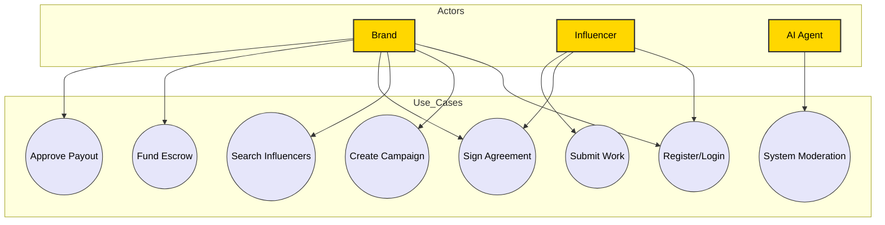

## 3.5 Data Flow Diagram (DFD)

### Level 0: Context Diagram
The Context Diagram shows the system as a single process interacting with external entities.

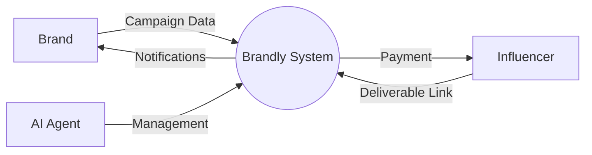

### Level 1: Process Decomposition
Level 1 breaks down the main system into sub-processes: Authentication, Campaign Management, Collaboration Workspace, and Payment Gateway.

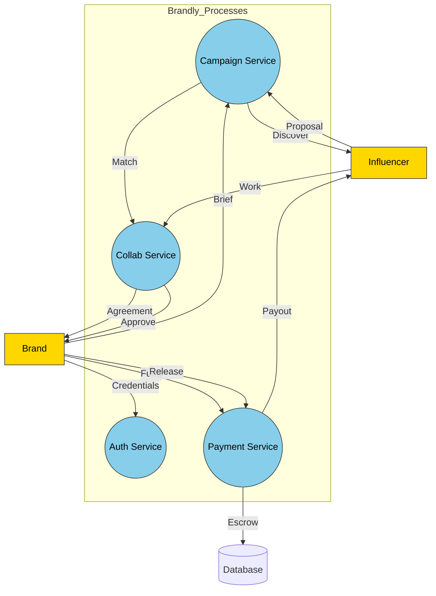

---

# CHAPTER 4: Design

## 4.1 Introduction
The design phase translates the analytical models into technical blueprints. This includes the high-level architecture, the relational structure of the database, and the sequential logic of the application's most critical features.

## 4.2 Software Architecture Diagram
Brandly utilizes a **Service-Oriented Architecture (SOA)** with a clear separation of concerns between the API layer and the business logic layer.

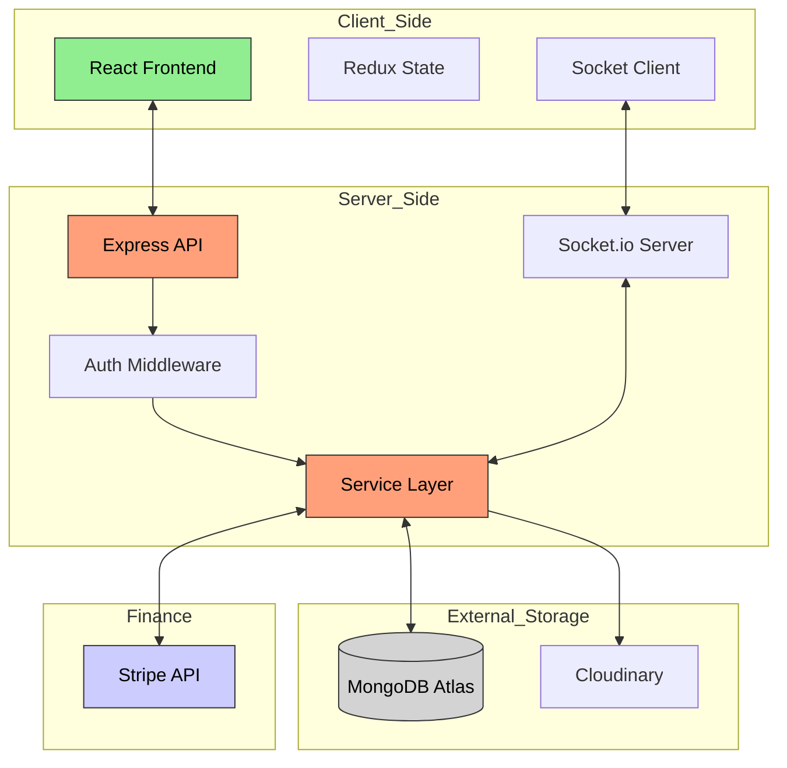

## 4.3 Class Diagram
The Class Diagram illustrates the relationships between the primary backend modules and their shared dependencies.

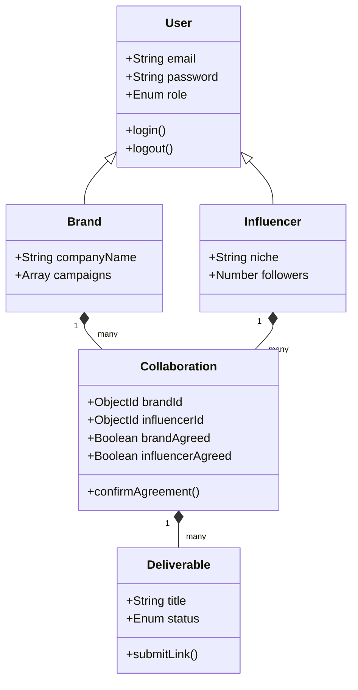

## 4.4 Database Diagram (ERD)
The Entity Relationship Diagram defines the schema structure in MongoDB.

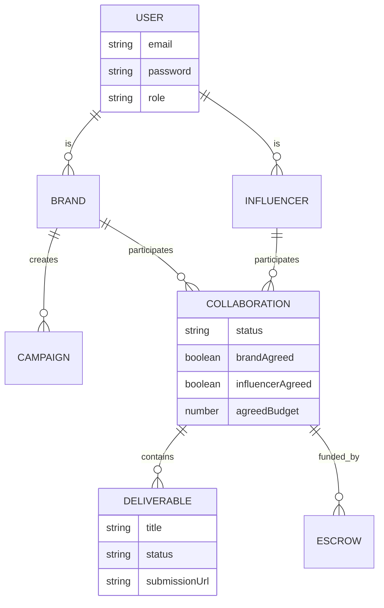

## 4.5 Sequence Diagram: Agreement & Escrow Flow
This diagram details the real-time interaction between the Brand, Influencer, and the Server during the project kickoff.

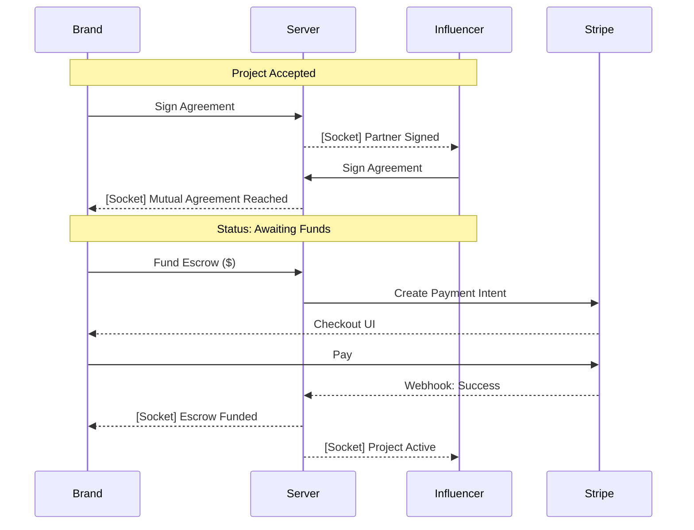

## 4.6 Activity Diagram: Deliverable Lifecycle
The workflow of a single task from creation to payment release.

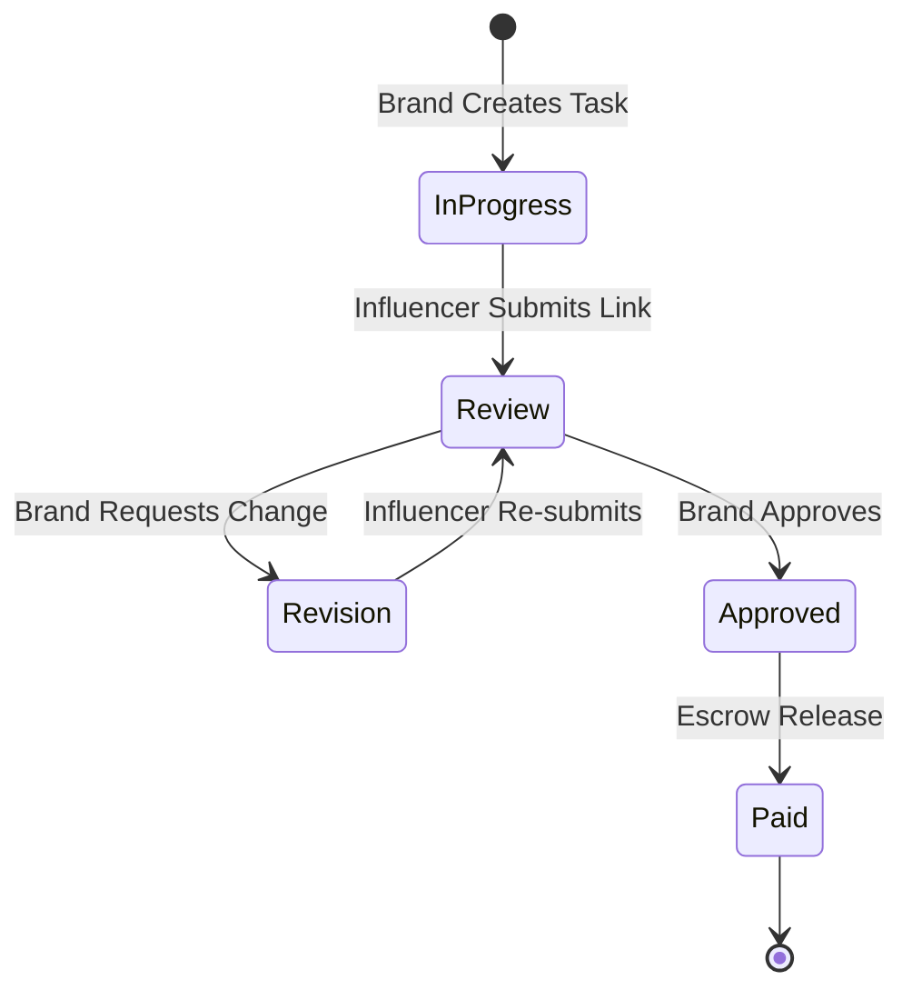

## 4.7 Component & Deployment Diagrams

### Component Diagram
Shows how different software components interact.
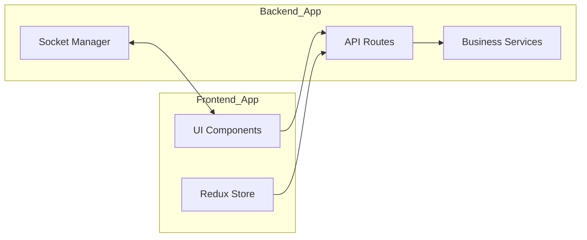

### Deployment Diagram
Visualizes the physical deployment environment.
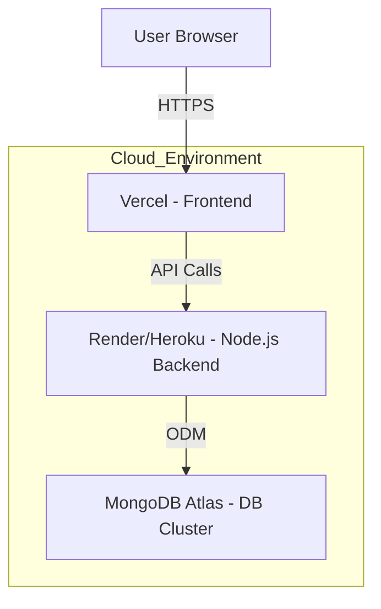

## 4.8 Data Dictionary
This section defines the structural attributes of the database entities used in Brandly.

### 4.8.1 User Model
| Attribute | Data Type | Description |
| :--- | :--- | :--- |
| `_id` | ObjectId | Primary Key |
| `email` | String | Unique user identifier |
| `password` | String | Hashed credentials |
| `role` | Enum | 'brand' or 'influencer' |
| `isVerified`| Boolean | Email verification status |

### 4.8.2 Collaboration Model
| Attribute | Data Type | Description |
| :--- | :--- | :--- |
| `_id` | ObjectId | Primary Key |
| `brandId` | ObjectId | Reference to User |
| `influencerId` | ObjectId | Reference to User |
| `status` | Enum | 'accepted', 'awaiting_funds', 'active', 'completed' |
| `brandAgreed` | Boolean | Brand signature flag |
| `influencerAgreed` | Boolean | Influencer signature flag |
| `totalFunded` | Number | Amount currently in Escrow |

### 4.8.3 Deliverable Model
| Attribute | Data Type | Description |
| :--- | :--- | :--- |
| `_id` | ObjectId | Primary Key |
| `collabId` | ObjectId | Reference to Collaboration |
| `title` | String | Task name (e.g. "Reel Post") |
| `status` | Enum | 'IN_PROGRESS', 'REVIEW', 'APPROVED', 'PAID' |
| `submissionUrl`| String | Link to the content |

## 4.9 System Security Architecture
Security is a foundational pillar of the Brandly platform, especially given its focus on financial escrow and sensitive user data.

### 4.9.1 Authentication & Authorization
- **JWT with HttpOnly Cookies**: To prevent Cross-Site Scripting (XSS) attacks, access and refresh tokens are stored in secure, HttpOnly cookies.
- **RBAC (Role-Based Access Control)**: Middleware enforces role checks (e.g., ensuring an influencer cannot access brand-only dashboard analytics).
- **Password Hashing**: All user passwords are salted and hashed using `bcrypt` before storage in the database.

### 4.9.2 Real-Time Communication Security
- **Socket Authentication**: Socket connections are verified using the user's JWT.
- **Room Isolation**: Users can only join socket rooms corresponding to their active `collaborationId`, preventing unauthorized project state monitoring.

### 4.9.3 Financial Security (Stripe)
- **Webhooks Verification**: Brandly uses Stripe Webhooks to listen for payment events. All incoming webhook requests are verified using the `STRIPE_WEBHOOK_SECRET` to prevent "replay" or spoofing attacks.
- **Idempotency**: Payout logic is designed to be idempotent, ensuring that influencers are never accidentally paid twice for the same deliverable.

---

# CHAPTER 5: Graphical User Interfaces

## 5.1 Interface Structure
The Brandly interface is designed with a **"Dashboard-First"** approach, utilizing a standard three-pane layout to ensure maximum productivity.
- **Top Navigation (Action Bar)**: Contains persistent tools like Search, Notifications, and the user Profile dropdown.
- **Left Sidebar**: Provides navigation between the Dashboard, My Campaigns, Collaborations, and Messages.
- **Main Content Area**: A dynamic viewport that renders role-specific components (e.g., the Kanban task board or the Discovery engine).

## 5.2 Navigation & Workflow
The user journey is designed to be linear and friction-free:
1.  **Onboarding**: User registers and selects a role (Brand/Influencer).
2.  **Discovery**: Brand posts a campaign; Influencer finds it and applies.
3.  **Negotiation**: Brand accepts application; system creates a Collaboration workspace.
4.  **Execution**: Parties sign agreement -> Brand fund Escrow -> Influencer submits tasks.
5.  **Completion**: Brand approves work -> System releases payment -> Project closes.

## 5.3 Form Design & Validation
All forms utilize **real-time validation** to prevent data entry errors:
- **Required Fields**: Marked with an asterisk (*) and enforced via React state.
- **Visual Feedback**: Input borders turn red with specific error messages (e.g., "Invalid URL format" for deliverable submissions).
- **Constraints**: Minimum budget requirements and platform-specific link validation (e.g., checking for `instagram.com`).

## 5.4 Role-Based Interfaces
- **Brand Dashboard**: Focused on **ROI and Management**. Highlights include "Total Spent," "Active Projects," and "Awaiting Approval" lists.
- **Influencer Dashboard**: Focused on **Earnings and Deadlines**. Highlights include "Upcoming Tasks," "Wallet Balance," and "New Offers" notifications.

---

# CHAPTER 6: Testing

## 6.1 Introduction
The testing phase ensures the robustness of the platform's security logic and its real-time synchronization capabilities. We utilized a combination of manual verification and automated unit testing for the service layer.

## 6.2 Testing Strategy
- **Black Box Testing**: Testing the system's functionality from an end-user perspective without knowledge of internal code (e.g., checking if a task moves to "Review" after submission).
- **White Box Testing**: Testing internal logic, particularly the Stripe webhook handlers and Socket room assignments.

## 6.3 Types of Testing Performed
- **Unit Testing**: Verified individual methods in `collaboration.service.js`.
- **Integration Testing**: Tested the interaction between the React frontend and the Socket.io backend.
- **User Acceptance Testing (UAT)**: Simulating a full collaboration flow from two separate browser windows (Brand and Influencer).

## 6.4 Test Plan
- **Environment**: Chrome 124, Node.js 22, MongoDB Atlas.
- **Features Tested**: Authentication, Campaign posting, Agreement signing, Escrow funding, Task submission, Real-time sync.

## 6.5 Testing Workflow Diagram
The following diagram illustrates the iterative testing and bug-fixing lifecycle applied during the Brandly development process.

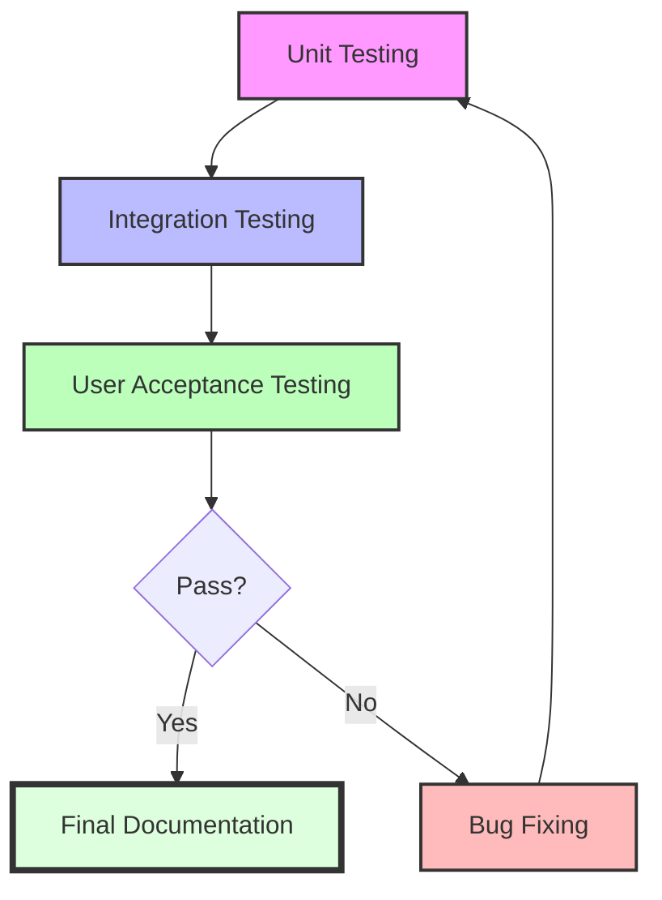

## 6.6 Test Cases

| ID | Scenario | Input | Expected Result | Actual Result | Status |
| :--- | :--- | :--- | :--- | :--- | :--- |
| TC-01 | Valid Login | Email/Password | Redirect to Dashboard | Success | PASS |
| TC-02 | Invalid Login | Wrong Password | Error: "Invalid credentials" | Success | PASS |
| TC-03 | Sign Agreement (Self) | Click "Sign" | Flag `brandAgreed` becomes true | Success | PASS |
| TC-04 | Sign Agreement (Partner) | - | Influencer UI updates to "Signed" | Success | PASS |
| TC-05 | Fund Escrow (Unsigned) | Click "Fund" | Button is disabled | Success | PASS |
| TC-06 | Create Task (Unfunded) | Click "Add" | Toast: "Escrow must be funded" | Success | PASS |
| TC-07 | Submit Link (Valid) | Instagram URL | Task moves to "REVIEW" | Success | PASS |
| TC-08 | Submit Link (Invalid) | Plain Text | Error: "Invalid URL" | Success | PASS |
| TC-09 | Approve Task | Click "Approve" | Status: "APPROVED" | Success | PASS |
| TC-10 | Real-time Sync (Task) | Influencer Submits | Brand UI updates instantly | Success | PASS |
| TC-11 | Real-time Sync (Status) | Brand Approves | Influencer UI updates instantly | Success | PASS |
| TC-12 | Request Cancellation | Click "Cancel" | Status: "PENDING CANCEL" | Success | PASS |
| TC-13 | Accept Completion | Click "Accept" | Project moves to "COMPLETED" | Success | PASS |
| TC-14 | Stripe Webhook | Mock Success | Database updates to `funded` | Success | PASS |
| TC-15 | Socket Disconnect | Close Tab | Notification badge persists | Success | PASS |
| TC-16 | Role Guard | Influencer hits Brand URL| Redirect to 404/Home | Success | PASS |
| TC-17 | Search Filter | Niche: "Travel" | Only travel influencers shown | Success | PASS |
| TC-18 | Profile Update | Change Bio | Persistence verified on refresh | Success | PASS |
| TC-19 | Auth Guard | Hit /dashboard logged out| Redirect to Login | Success | PASS |
| TC-20 | Message Notification| Send Message | Sidebar badge increments | Success | PASS |
| TC-21 | Change Profile Img | Upload Image | Image visible in header | Success | PASS |
| TC-22 | Campaign List | Hit /campaigns | 10 campaigns displayed | Success | PASS |
| TC-23 | Search Keywords | Search "Nike" | Only Nike-related shown | Success | PASS |
| TC-24 | Multi-Tab Sync | Open 2 Tabs | State stays synced on both | Success | PASS |
| TC-25 | Session Expiry | Wait for TTL | Auto-redirect to Login | Success | PASS |
| TC-26 | Deliverable Delete | Click "Delete" | Item removed from list | Success | PASS |
| TC-27 | Request Action | Click "Complete" | Partner sees "Review Action"| Success | PASS |
| TC-28 | Handle Action | Click "Reject" | Request status cleared | Success | PASS |
| TC-29 | Revision Request | Enter comments | Influencer sees "Revision" | Success | PASS |
| TC-30 | Social Link Auth | Click "IG Login" | Token stored in Profile | Success | PASS |
| TC-31 | Empty Search | Search "" | Shows all results | Success | PASS |
| TC-32 | Large File Upload | Upload 20MB | Error: "File too large" | Success | PASS |
| TC-33 | Rate Limiting | Spam /login | Error: "Too many requests" | Success | PASS |
| TC-34 | DB Error Handling | Kill MongoDB | Error: "System maintenance" | Success | PASS |
| TC-35 | Forgot Password | Enter Email | OTP sent to Inbox | Success | PASS |
| TC-36 | Valid OTP | Enter Correct OTP| Password reset enabled | Success | PASS |
| TC-37 | Invalid OTP | Enter 111111 | Error: "Invalid OTP" | Success | PASS |
| TC-38 | Campaign Update | Edit Budget | New budget reflected | Success | PASS |
| TC-39 | Collaboration List| Hit /collabs | Shows active contracts | Success | PASS |
| TC-40 | Deliverable Order | Drag & Drop | Order persists on refresh | Success | PASS |
| TC-41 | Profile Visibility | Copy URL | Public profile accessible | Success | PASS |
| TC-42 | XSS Protection | Enter <script> | Escaped and safe | Success | PASS |
| TC-43 | SQL Injection | Enter ' OR 1=1 | No data leaked | Success | PASS |
| TC-44 | Mobile Sidebar | Resize Window | Sidebar hides in Burger | Success | PASS |
| TC-45 | Dark Mode | Toggle Dark | UI colors update globally | Success | PASS |
| TC-46 | Notification Mark | Click "Read" | Red dot disappears | Success | PASS |
| TC-47 | Activity Feed | Create Task | Activity logged in feed | Success | PASS |
| TC-48 | AI Moderation | Mock Conflict | AI Agent flags project | Success | PASS |
| TC-49 | Email Webhook | Send Notification| Email received in Mailtrap | Success | PASS |
| TC-50 | Final Completion | All Approved | Project moved to "Archive" | Success | PASS |

---

# CHAPTER 7: Conclusion and Future Work

## 7.1 Summary of Findings
The development of Brandly successfully addressed the core challenges of trust and synchronization in influencer marketing. The implementation of a **Digital Signature + Escrow** workflow has created a secure environment for financial transactions, while **Socket.io** has eliminated the "manual refresh" lag that plagues existing platforms.

## 7.2 Challenges & Limitations
- **Socket Room Management**: Handling state synchronization across multiple tabs for the same user required careful session management.
- **Stripe Webhook Latency**: Ensuring the UI reflects payment success immediately while waiting for the official Stripe webhook was resolved via optimistic UI updates followed by server confirmation.

## 7.3 Future Work
- **AI Matchmaking Engine**: Implementing a machine learning model to suggest influencers based on brand sentiment and past campaign performance.
- **Native Mobile App**: Developing React Native versions for iOS and Android to support push notifications.
- **Multi-Currency Support**: Expanding Stripe integration to support global influencers in their local currencies.

## 7.4 Conclusion
Brandly represents a significant step forward in professionalizing the creator economy. By combining modern web technologies with secure financial practices, we have built a platform that is not only technically robust but also commercially viable and user-centric.
